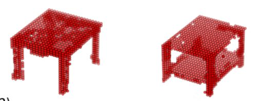

# 3D-VoxGAN
3D Shape reconstruction

Created by ----->Rohit Rai, Md Meraz and Mohammed Javed

## Release

Souce code will be publicly available by november first week.

## How to use Code
Requirements

- Python 3.7 
- Pytorch 1.7
- Cuda 9.2
- scikit learn, HD5

---
## Point Cloud Classification
--------------------
### Training

---
## Point Cloud Part-Segmentation
--------------------
### Training

### Evaluation

### Performance:

---
## Citation 
---
